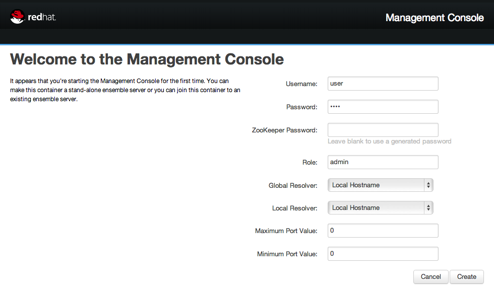
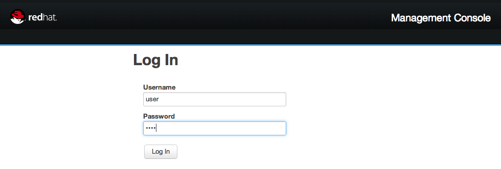
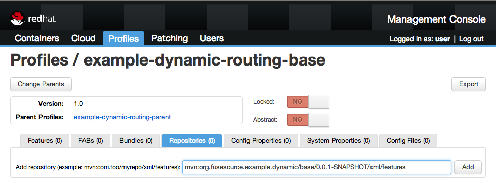
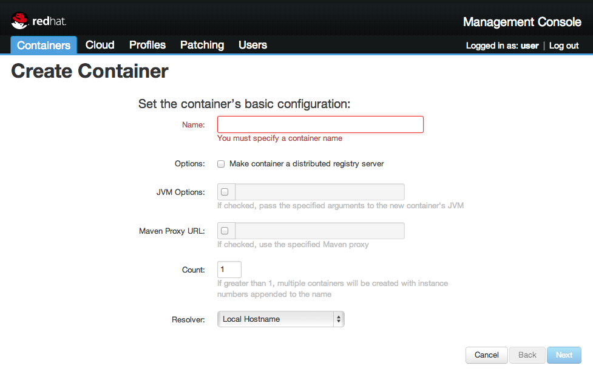

# Camel and JBoss Fuse Dynamic Routing Example

## Overview

This example shows how to use [Apache Camel][], and its OSGi integration to dynamically route messages to new or updated
OSGi bundles within [JBoss Fuse][]. This allows you to route to newly deployed services **at runtime** without impacting
running services.

This example combines use of the Camel [Recipient List][], which allows you to at runtime specify the [Camel Endpoint][]
to route to, and use of the [Camel VM][] Component, which provides a [SEDA][] queue that can be accessed from different
OSGi bundles running in the same Java virtual machine.

Note: Extra steps, like use of Camel VM Component, need to be taken when accessing Camel Routes in different Camel
Contexts, and in different OSGi bundles, as you are dealing with classes in different ClassLoaders...

### Alternative Approaches

Instead of using [Camel VM][] Component, use of [ActiveMQ Camel][] Component would also work. You'd need to configure a
single ActiveMQ broker instance that all Camel routes can reference. To optimize performance, if the ActiveMQ broker
runs embedded within JBoss Fuse, then you can use ActiveMQ's [VM Transport][], which is conceptually similar to Camel's VM
Component in that it effectively uses direct method calls to enhance message transfer to and from the ActiveMQ Broker
within a single Java Virtual Machine. This approach *may* be slightly less efficient than using the [Camel VM][]
approach, but use of ActiveMQ would allow to easily horizontally scale out multiple Fuse instances.

You could also use the [Camel NMR][] Component, which leverages JBoss Fuse / Apache [ServiceMix NMR][] component. This
provides a way to reference named endpoints across OSGi bundles. The issue with this approach is that the NMR within
JBoss Fuse / ServiceMix is loosing favor within the Apache ServiceMix community, and may be deprecated in the not to
distant future.

At the end of this ReadMe is a section describing how to management a deployment of this example using [Fuse Fabric][]
and Management Console.

---

### Requirements:

* JBoss Fuse 6.0.0 or later (https://access.redhat.com/jbossnetwork - registration required)
* Maven 2.2.1 or 3.0 (http://maven.apache.org/)
* Java SE 6

### Notes:

* if you see linkage errors related to javax.activation.DataHandler, you may need to edit JBoss Fuse's
 `etc/jre.properties` file, and add javax.activation to the list of packages exported by the base
 bundle by uncommenting (remote the leading '#') the javax.activation line.

    jre-1.6= \
      javax.accessibility, \
      javax.activation;version="1.1", \
      javax.activity, \
      ....

* In JBoss Fuse, make sure that you've added a smx/smx userid and password to
 `<JBoss Fuse Home>/etc/users.properties`, or update the included Camel route to the userid and
 password you have defined for the JBoss Fuse embedded ActiveMQ.

---

## Building and Running

To build this project use [Apache Maven][] in the base directory of this project

    mvn install

This example will be deploying into [JBoss Fuse][]. Follow the instructions to download, and install your own copy.

Below are a sequence of steps that highlight the core concepts:

1. Install Base Service
2. Test Base Service
3. Deploy Newservice Service
4. Test Base Service now able to route to both existing and new

### 1. Install Base Service

Within the Base Camel route there are 3 routes:

* an HTTP listener that routes to other endpoints based on the contents of the request
* a “simple” route that responds with a “Simple Response: {body of message}”
* a “other” route that responds with a “Other Response: {body of message}”

Start JBoss Fuse, by running the included start script

    <JBoss Fuse Home>/bin/fuse

In the JBoss Fuse console, do the following

    features:addurl mvn:org.fusesource.example.dynamic/features/0.0.1-SNAPSHOT/xml/features
    features:install dynamic-routing-base

### 2. Testing Base Service

Then in a different Command Prompt, change to the `client` sub-project, and run

    mvn -Psimple

You should see log entries in both JBoss Fuse console, and the Command Prompt that messages are flowing to the Simple Route

    18:37:45,126 | INFO  | qtp317981251-233 | Base                             | 139 - org.apache.camel.camel-core - 2.10.0.redhat-60024 | Processing: direct:simple
    18:37:45,127 | INFO  | qtp317981251-233 | Simple                           | 139 - org.apache.camel.camel-core - 2.10.0.redhat-60024 | Processing: direct:simple
    18:37:46,043 | INFO  | qtp317981251-232 | Base                             | 139 - org.apache.camel.camel-core - 2.10.0.redhat-60024 | Processing: direct:simple
    18:37:46,043 | INFO  | qtp317981251-232 | Simple                           | 139 - org.apache.camel.camel-core - 2.10.0.redhat-60024 | Processing: direct:simple

You can also try the Other route to see that the recipient list is working correctly within the Base service

    mvn -Pother

with the following log output

    18:39:59,483 | INFO  | qtp317981251-232 | Base                             | 139 - org.apache.camel.camel-core - 2.10.0.redhat-60024 | Processing: direct:other
    18:39:59,484 | INFO  | qtp317981251-232 | Other                            | 139 - org.apache.camel.camel-core - 2.10.0.redhat-60024 | Processing: direct:other
    18:40:00,399 | INFO  | qtp317981251-235 | Base                             | 139 - org.apache.camel.camel-core - 2.10.0.redhat-60024 | Processing: direct:other
    18:40:00,400 | INFO  | qtp317981251-235 | Other                            | 139 - org.apache.camel.camel-core - 2.10.0.redhat-60024 | Processing: direct:other

### 3. Deploying Newservice Service

In the JBoss Fuse console, do the following

    features:install dynamic-routing-newservice

### 4. Testing Newservice Service

Then in a different Command Prompt, change to the `client` sub-project, and run

    mvn -Pnewservice

You should see log entries in both JBoss Fuse console, and the Command Prompt that messages are flowing to the New Service
Route

    18:41:51,479 | INFO  | qtp317981251-233 | Base                             | 139 - org.apache.camel.camel-core - 2.10.0.redhat-60024 | Processing: vm:newservice
    18:41:51,480 | INFO  |  vm://newservice | newservice-route                 | 139 - org.apache.camel.camel-core - 2.10.0.redhat-60024 | Message: vm:newservice
    18:41:51,489 | INFO  | umer[newservice] | newservice-consumer              | 139 - org.apache.camel.camel-core - 2.10.0.redhat-60024 | Consumer: vm:newservice
    18:41:52,394 | INFO  | qtp317981251-232 | Base                             | 139 - org.apache.camel.camel-core - 2.10.0.redhat-60024 | Processing: vm:newservice
    18:41:52,396 | INFO  |  vm://newservice | newservice-route                 | 139 - org.apache.camel.camel-core - 2.10.0.redhat-60024 | Message: vm:newservice
    18:41:52,399 | INFO  | umer[newservice] | newservice-consumer              | 139 - org.apache.camel.camel-core - 2.10.0.redhat-60024 | Consumer: vm:newservice

Notice that the original Base service did not reload or restart to start forwarding messages to the newly loaded routes.
You can re-run the original tests against `mvn -Psimple` and `mvn -Pother` to see that those still work correctly.

Newservice grabs the messages from the Camel VM component, and puts them onto (and off of) an ActiveMQ Queue. This shows
how to route to new endpoints and integration routes at runtime -- it does not have to be ActiveMQ, it could easily be
WS, REST, other JMS (Tibco, WMQ), etc.

---

## Managing a Deployment using Fuse Fabric

### Overview

[Fuse Fabric][] is a runtime environment that leverages capabilities of [Apache Karaf][], the container underlying JBoss
Fuse, to provide centralized configuration and provisioning capabilities. In brief, [Fuse Fabric][]
provides the ability to create container instances running locally or remotely, including on cloud environments like
Amazon EC2 and Rackspace. You can then create and apply Profiles that define what OSGi bundles and associated
configurations (name / value pairs) to apply to each managed container.

Management Console provides a web-based user interface to make it easier to interact with Fuse Fabric than
Fabric’s provided command-line interface.

### Setup and Testing

To start the management console, install the `fabric-webui` feature from the Fuse console.

    features:install fabric-webui

Once the server has started, open a web browser and go to <http://localhost:8181/>.

Click the `Create` button if this is your first time running and configure a `Username` and `Password` and an optional `ZooKeeper Password`
for the ensemble server. Since we're only going to use the local system to host our containers, you can skip the other fields.

Click the `Create` button and log in with your brand new credentials

Once you're logged in you can see the tab-bar at the top, the list of containers on the left and some container information on the right.

### Create Profiles

*Profiles* have an inheritance concept where parent profile’s configuration and bundles are applied fully before the
child profiles. It is a good practice to create parent profiles for common configurations shared across your
applications. Using parent profiles can also help ensure dependent bundles are fully deployed **before** child profile
bundles. To be clear, Fuse Fabric only has a single concept called *Profile*, and they act as parent or child purely
based on their relationship to other profiles, that is when you create a profile you can specify zero of more other
profiles (which may also have parent profiles) to be the parent of the profile you are creating.

For the purposes of this example, we will create a single parent profile called `example-dynamic-routing-parent` that
will be shared (parent profile of) the 2 service profiles: `example-dynamic-routing-base` and
`example-dynamic-routing-newservice`.

Select the `Profiles` tab, and push the `Create Profile` button on upper right. You will be prompted to enter a name,
and select zero or more Parent Profiles.

Follow the details below to create the three target Profiles:

Name: `example-dynamic-routing-parent`  
Parent Profiles: `camel` and `karaf`  

Name: `example-dynamic-routing-base`  
Parent Profiles: `example-dynamic-routing-parent`  

Name: `example-dynamic-routing-newservice`  
Parent Profiles: `example-dynamic-routing-parent`  

To edit the `example-dynamic-routing-base` settings, select the profile from the profiles list in the profiles tab.
Head to the `Repositories` tab and add the `mvn:org.fusesource.example.dynamic/base/0.0.1-SNAPSHOT/xml/features`
repository.

Browse to the `Features` tab and select the repository you just added. The `dynamic-routing-base` feature will appear
at the bottom. Add this feature by clicking the `+` button on the right.

Repeat this for the `example-dynamic-routing-newservice` profile. Add the
`mvn:org.fusesource.example.dynamic/newservice/0.0.1-SNAPSHOT/xml/features` repository so you can add the
`dynamic-routing-newservice` feature.

### Creating Container

Fuse Fabric allows you to create managed Containers to which you can deploy one or more profiles. A managed
Container is initially a minimal [Apache Karaf][] instance with a Fuse Fabric agent bundle deployed. For this example,
we will create a single Container that we will first deploy the Base service to, test it, and then deploy Newservice,
and test both.

Select the `Containers` tab, and press the `Create Container` button. You will be prompted to enter a name (e.g.
`Dynamic-Routing`). 

Press `Next` in the lower right. You will then be prompted to select the zero or more Profiles to
initial provision the container with. Select `example-dynamic-routing-base`, and press `Next`. 

At th next form leave the defaults for now, and press `Next` and then `Finish`.

At this point, it will create a new Container instance, and initially provision it with our example-dynamic-routing-base
Profile (i.e. deploy the Base service OSGi bundle). You can verify that it is running correctly by, from a separate
Command Prompt, running the test client : `mvn -Psimple` and `mvn -Pother`. In the upper right of the Container tab, you
can select the `Detail` button to see more information on the deployed Container, including drilling into seeing the
deployed Camel routes.

To deploy newservice, push the `Add Profiles` button with your created Container, and add
`example-dynamic-routing-newservice`. This will provision the newservice bundle to the running Container, and you can
verify that it is running by trying the test client `mvn -Pnewservice`

[Apache Camel]: http://camel.apache.org
[Apache Karaf]: http://karaf.apache.org
[Apache Maven]: http://maven.apache.org
[ActiveMQ Camel]: http://camel.apache.org/activemq.html
[Camel Endpoint]: http://camel.apache.org/endpoint.html
[Camel NMR]: http://camel.apache.org/nmr
[Camel VM]: http://camel.apache.org/vm.html
[JBoss Fuse]: https://www.redhat.com/products/jbossenterprisemiddleware/fuse/
[Fuse Fabric]: http://fuse.fusesource.org/fabric/index
[Recipient List]: http://camel.apache.org/recipient-list.html
[SEDA]: http://www.eecs.harvard.edu/~mdw/proj/seda/
[VM Transport]: http://activemq.apache.org/vm-transport-reference.html
